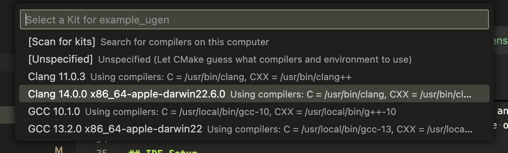
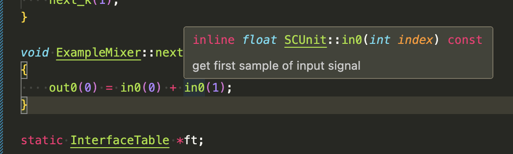
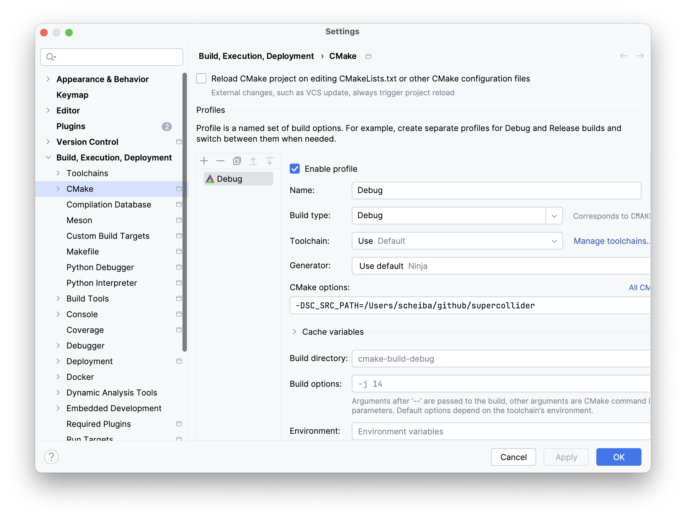
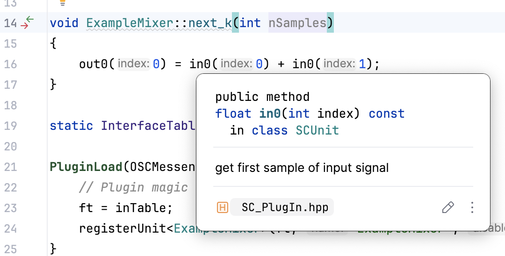
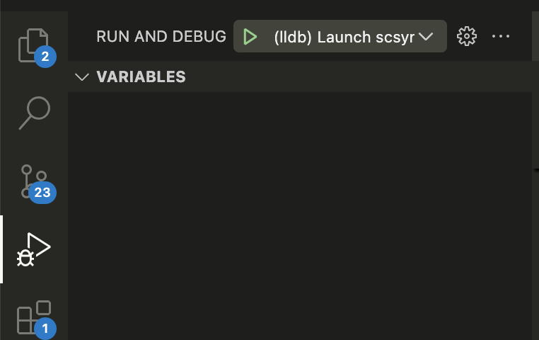
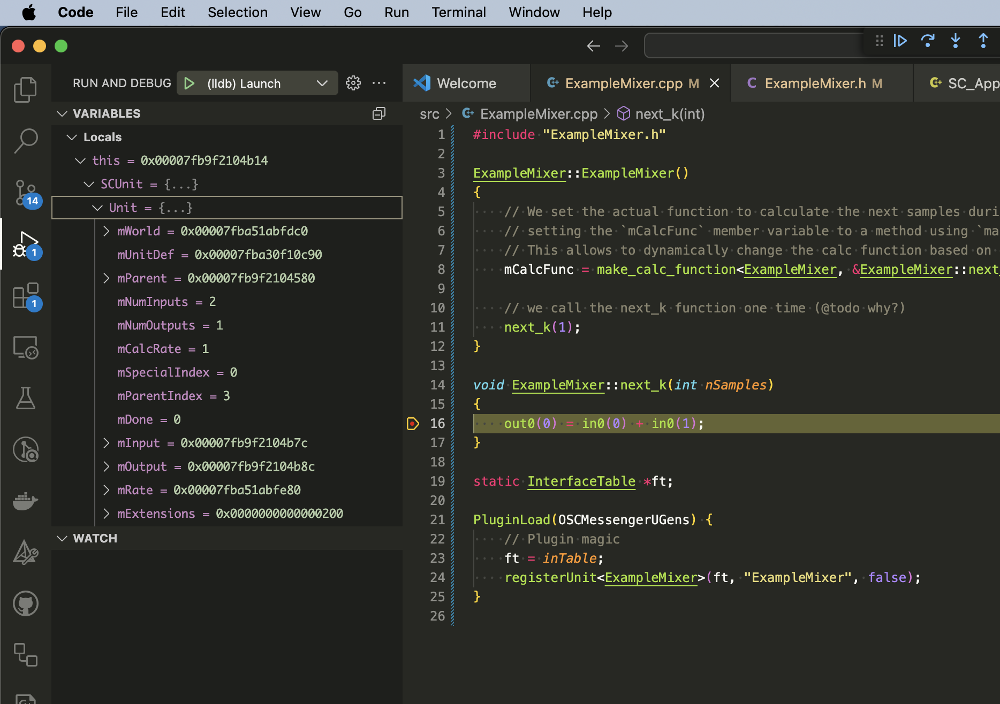
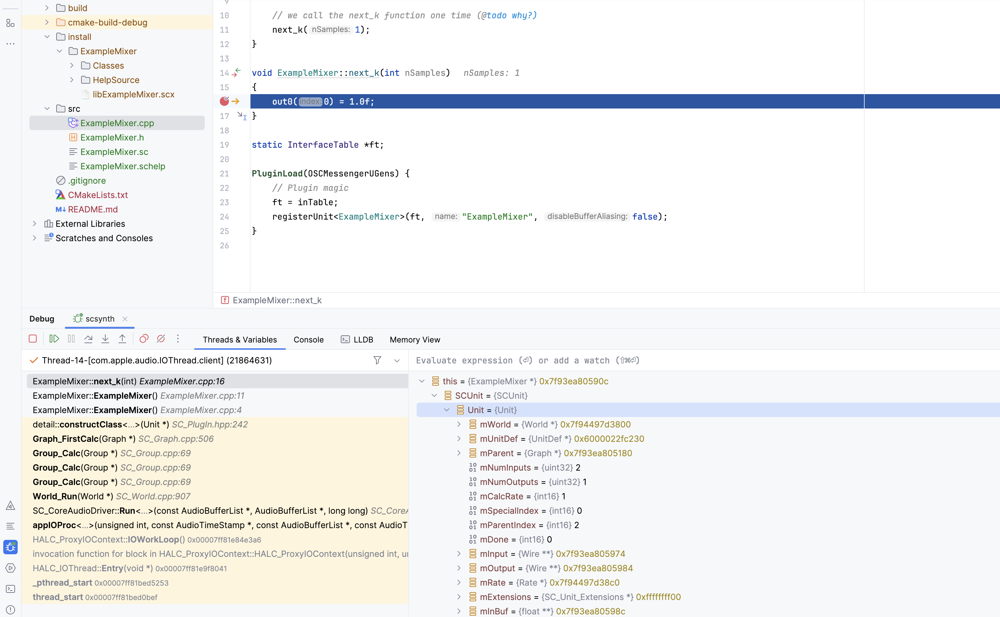

# Example UGen

> This guide is primarily geared towards GNU/Linux and macOS.
> It would be greatly appreciated if someone can provide the additional steps for using this guide with Windows via a PR.

This repo contains is a simple [_UGen_](https://docs.supercollider.online/Classes/UGen.html) (aka an [_Extension_](https://docs.supercollider.online/Guides/UsingExtensions.html)) and should provide a guide on how to build UGens by oneself.
The UGen will be a trivial mixer which simply sums two signals.

Instead of writing the optimized mixer or something an actual interesting UGen the intention of this guide is on how to start development of such a custom UGen.

This is also an _opinionated_ guide which

* favors native C++ classes over a C-with-classes approach which is also common within SuperCollider development
  (If you don't know what the difference between both approaches is - don't worry)
* favors C++ class methods over pre-processor macros
* favors readability over performance as UGen/DSP optimizations is a topic on its own and may distract at the beginning.

## Features and Goals

The guide tries to cover the following steps

* How to setup an IDE environment such as [VSCode](https://code.visualstudio.com/) or [CLion](https://www.jetbrains.com/clion/).
  An IDE helps to navigate and understand the code and also allows to debug the UGen while it is running.
* How to write a UGen really basic UGen.
  By making the C++ code very concise, every LOC is commented and can be understood.
  There is also some annotation on what sclang glue code is necessary for the UGen.
* How to write a CMake file that will build the UGen and how to use it to build the UGen.
* How to test the plugin within SuperCollider
* How to debug the UGen within an IDE

Additionally, this repository also includes a [GitHub Actions](https://github.com/features/actions) workflow which builds the plugin on every major platform and can be used as a blueprint for your UGen repository.

What this guide will not cover

* How to actually implement something interesting within the UGen and taking into account SuperCollider specifics such as [`RTAlloc`](https://docs.supercollider.online/Guides/WritingUGens.html#Memory%20Allocation) (a realtime memory allocation implementation).
  The documentation and other existing UGens should give you a hint on how to continue.
* Optimizations: Although optimizations make SuperCollider such an efficient platform it provides further complexities which are more tied to the usage of C++ and therefore create some additional mental overload.
  The existing UGens in the default library can serve as example of highly optimized UGens.

## UGen vs Quark

A _Quark_ is an extension of functionality within sclang, the language of the SuperColider framework.
Quarks are written in sclang and their source code is normally distributed to the user by using _git_.
For further information on Quarks see [_Using Quarks_](https://dev.docs.supercollider.online/Guides/UsingQuarks.html) in the SuperCollider documentation.

An _Extension_ on the other hand is a _UGen_ which adds functionality such as new synthesis methods to the server (either be _scsynth_ or _supernova_) and needs to be written in C++ and compiled to bytecode.

This compiled byte code must match

* The operating system (macOS, GNU/Linux, Windows, ...)
* The processor architecture (x64, x86, arm32, arm64, ...)
* The SuperCollider Plugin API version (there are occasionally changes to this interface)

> Using solely other UGens as building blocks for a new UGen is also a common way, see [_Pseudo_-UGens](https://docs.supercollider.online/Guides/WritingUGens.html#Pseudo-UGens), where [_miSCellaneous_lib_](https://github.com/dkmayer/miSCellaneous_lib/) is a prime example of this approach.

## First step

In order to build an extension it is necessary to obtain the SuperCollider source code to your local computer as it is necessary to use the standardized entrypoints (aka API) for our UGen which the SuperCollider source code provides.

Create or use a folder to contain your source code repositories (such as `~/git/`), navigate a terminal to this folder and execute

```shell
git clone --recursive https://github.com/SuperCollider/supercollider.git
```

> It is advisable to build SuperCollider from its sources to verify all necessary dependencies for SuperCollider are installed on your system.
>
> Check the SuperCollider documentation on how to setup your machine for a build of SuperCollider
>
> * [README_LINUX.md](https://github.com/supercollider/supercollider/blob/develop/README_LINUX.md)
> * [README_MACOS.md](https://github.com/supercollider/supercollider/blob/develop/README_MACOS.md)
> * [README_WINDOWS.md](https://github.com/supercollider/supercollider/blob/develop/README_WINDOWS.md)

## IDE Setup

Assistance from an IDE is beneficial while developing C++ code as it will give some hints on the _Dos and Dont's_ and will give hint of code usage before compilation.

> Feel free to do a PR on this project to include more IDEs

### VSCode

* Clone this repository to your local computer and open the folder in VSCode
* A popup in the lower corner may ask you to install some plugins (see `.vscode/extensions.json`) - if it appears: install the plugins and restart VSCode
* If all plugins are available, VSCode will ask which compiler it should use to build the project.
  This compiler to use depends on your operating system.
  For MacOS you should choose the most recent _clang_.
  
* As we need to include the source code (or _headers_) of the SuperCollider Plugin API it is necessary to tell VSCode where these files are located.
  We cane make use of VSCode CMake plugin to fetch these files by telling the plugin where our local SuperCollider source code repository is located on our computer.
  > The location of the SuperCollider source code is passed to CMake using a [CMake Variable](https://cmake.org/cmake/help/latest/manual/cmake.1.html#cmdoption-cmake-D) with the name `SC_SRC_PATH` (CMake variables are prepended with a `-D` in CLI).

  If not already present, create a `.vscode/settings.json` in your local repository and add the following entry

  ```json
  {
      "cmake.configureSettings": {
          // this needs to point to your local supercollider repository
          "SC_SRC_PATH": "/Users/myUser/git/supercollider"
      }
  }
  ```

* Restart VSCode and you should have proper IntelliSense for the C++ source files.

  

### CLion

* Clone this repository to your local computer and open the folder in CLion
* Open the settings dialog (either via top-menu-bar or via `cmd+,`) - click on _Build, Execution, Deployment_ tab on the right side and select CMake
* Select a profile (e.g. _Debug_).
* In the _CMake options_ dialog enter the path of your local SuperCollider source files, e.g. `-DSC_SRC_PATH=/Users/scheiba/github/supercollider`

  

* Click _OK_. The project should be reloaded and IntelliSense should be available.
  If there are still errors, force a reload of the CMake project by clicking on _File->Reload CMake project_ or restart CLion.
  
  

## Building

In order to convert the C++ source code into byte code it is necessary to build it.
Building a UGen with CMake consists of two steps:

* Configure the build using CMake
* Use the generated files from the configure step to build a target

### Building via command line

* Assuming you have a terminal located in the folder of this repository, create a `build` directory and `cd` into it
  
  ```shell
  mkdir build
  cd build
  ```

* Configure the build to pick up the SuperCollider plugin headers
  
  ```shell
  cmake -DSC_SRC_PATH=/path/to/your/local/supercollider/source/files ..
  ```

* Build the UGen via
  
  ```shell
  cmake --build . --target install
  ```

* All necessary files of the UGen will be put into an `install` folder in your repo

### Building via VSCode

* Configure the build by opening the command palette via `Cmd+Shift+p` and select `CMake: Configure`.
  VSCode will pick up the necessary `-DSC_SRC_PATH` variable through our configuration within `.vscode/settings.json`.
* Build the install target by opening the command palette and select `CMake: Build Target` and select `Install`.

### Building via CLion

* Click on the top right hammer symbol to build the selected target.
* In order to build the install target, click on _Build_ in the menu bar and click on _Install_.

## Testing the UGen

In order to test the UGen it is necessary to run it on a SuperCollider server (scsynth or supernova).
In order to be picked up by the server we need to copy the compiled files of our UGen (located in the `install` folder) into SuperColliders extension folder which can be found by executing `Platform.userExtensionDir.openOS` within sclang.

> When working in a Unix environment it is advisable to setup a [symlink](https://manpages.debian.org/bookworm/coreutils/ln.1.en.html) via `ln`.
> This makes it obsolete to copy the new files after a new build and creates a faster developing-and-testing cycle.
> Navigate a terminal to the path of `Platform.userExtensionDir` and execute the command
>
> ```shell
> ln -s /path/to/my/ugen/install/ExampleMixer .
> ```

Afterwards, re-compile the class library and boot the server and try out the UGen via

```supercollider
// boot the server
s.boot;

// spawn an example mixer
x = {ExampleMixer.kr(sigA: SinOsc.kr(0.5), sigB: SinOsc.kr(1.1)).poll}.play;
// if everything is successful, free the node
x.free;
```

If everything works there should be no crashes of the server and some numbers of our `ExampleMixer` should be printed to the post window.

## Change code

After successfully building the UGen from its C++ sources it is now time to take a look at

* the C++ file `src/ExampleMixer.cpp`
* the CMake file `CMakeLists.txt` which acts as a blueprint on how to convert our C++ source code into bytecode
* the sclang glue code located in `src/ExampleMixer.sc`
* and the sclang help file located in `src/ExampleMixer.schelp`

Try to understand each line and feel free to modify it to change its behavior.
Of course, after every modification it is necessary to re-build the UGen and copy its compiled output to the proper locations in order that scsynth/supernova can pick it up upon (re-)boot.

## Debugging

In order to understand the mechanics and also trace unintended behavior it is helpful to debug your UGen.
In order to to this it is necessary to have a local debug build of SuperCollider (or at least of scsynth/supernova).

This build needs to match Plugin API version we used to build the plugin (if the server did not crash while running the UGen it is a matching API version).

Refer to the SuperCollider documentation on how to build SuperCollider on your system.
It is necessary to make a debug build (by adding the `--config Debug` flag on the build step)

* [README_LINUX.md](https://github.com/supercollider/supercollider/blob/develop/README_LINUX.md)
* [README_MACOS.md](https://github.com/supercollider/supercollider/blob/develop/README_MACOS.md)
* [README_WINDOWS.md](https://github.com/supercollider/supercollider/blob/develop/README_WINDOWS.md)

**Important:** As the plugin is loaded dynamically as a module during the startup procedure of the server it is actually necessary to have the debugger attached during this startup procedure.

### Debugging in VSCode

As VSCode does not provide a way to wait for a process to appear, it is necessary to start `scsynth` from within VSCode.

* Build the install target of the plugin in Debug mode and copy the content of the install folder to `Platform.userExtensionDir` (see above)
* If not existing, create a file `.vscode/launch.json` whose content should look something like
  
  ```json
  {
      "version": "0.2.0",
      "configurations": [{
          "name": "(lldb) Launch scsynth",
          "type": "cppdbg",
          "request": "launch",
          // this needs to point to a debug build of scsynth
          "program": "/Users/scheiba/github/supercollider/build/Install/SuperCollider/SuperCollider.app/Contents/Resources/scsynth",
          "args": ["-u", "57110", "-a", "1024", "-i", "0", "-o", "2", "-R", "0", "-l", "1"],
          "stopAtEntry": false,
          "cwd": "${fileDirname}",
          "environment": [],
          "externalConsole": false,
          "MIMode": "lldb"
      }],
  }
  ```

  > The exact content can deviate depending on your platform (e.g. `lldb` is the llvm debugger used in macOS).
  > For more information see [Debug C++ in Visual Studio Code](https://code.visualstudio.com/docs/cpp/cpp-debug).

* Launch scysnth via VSCode by clicking on the _Run and Debug_ icon on the left tab and press the green play button next to the selected _(lldb) Launch scysnth_.
  
* Open the SuperCollider IDE and instead of booting the server from within the IDE, we will connect to the already booted server from VSCode via

  ```supercollider
  // attach to the server running in vscode
  ~debugServer = Server.remote(\debugServer, NetAddr("127.0.0.1", 57110));
  
  // launch the example mixer on the vscode server
  x = {ExampleMixer.kr(SinOsc.kr(0.5), SinOsc.kr(1.1))}.play(target: ~debugServer);
  ```

* [Set a breakpoint](https://code.visualstudio.com/Docs/editor/debugging#_breakpoints) within the `ExampleMixer::next_k` method.
  The debugger should halt the execution of scsynth and the information about the UGen should be visible.

  

### Debugging in CLion

CLion allows to wait for a process to appear and attach a debugger immediately.

* Build the install target of the plugin in Debug mode and copy the content of the install folder to `Platform.userExtensionDir` (see above)
* In the top menu bar select _Run->Attach to unstarted process_
* In the command line input type in `scsynth` and press _Attach with bundled LLDB_ (the actual debugger may differ based on your platform)
* Boot up your debug build of scsynth, e.g. by typing `s.boot();` in the IDE.
* Run an instance of our `ExampleMixer` via

  ```supercollider
  x = {ExampleMixer.kr(SinOsc.kr(0.5), SinOsc.kr(1.1))}.play();
  ```

* [Add a breakpoint](https://www.jetbrains.com/help/clion/using-breakpoints.html) within the `next_k` method within `ExampleMixer.cpp` and wait for the debugger to halt scsynth
  

## Next steps

From here on you should be set to write your own UGens!
Consider taking a look at these additional resources:

* Read the chapter _Writing Unit Generator Plug-ins_ in [The SuperCollider book](https://mitpress.mit.edu/9780262232692/the-supercollider-book/)
* SuperCollider documentation about [_Writing Unit Generators_](https://dev.docs.supercollider.online/Guides/WritingUGens.html) and [_Server Plugin API_](https://dev.docs.supercollider.online/Reference/ServerPluginAPI.html).
* [Example UGens repository](https://github.com/supercollider/example-plugins) and [sc3-plugins repository](https://github.com/supercollider/sc3-plugins) for some more advanced examples.
  The [UGens that are included in SuperCollider](https://github.com/supercollider/supercollider/tree/develop/server/plugins) are highly optimized and are not the easiest to digest in the beginning but worth taking a look.
* Take a look at how to include source code from other C/C++ projects into a SuperCollider UGen which ports the code of the Mutable Instruments eurorack modules to SuperCollider.
  A good example can be found at <https://github.com/v7b1/mi-UGens>.
* There are many resources to learn C++.
  One recommendation though is <https://www.learncpp.com/>.
* Take a look at the [CMake Tutorial](https://cmake.org/cmake/help/latest/guide/tutorial/) in order to create builds which are more complex.
* Contribute to SuperCollider <3

## FAQ

### Why not use git submodules for the SuperCollider sources?

Although [git submodules](https://git-scm.com/book/en/v2/Git-Tools-Submodules) is a great way to reference external source code, it is actually beneficial to not bundle the SuperCollider source code with the UGen and instead let the user provide the source code of SuperCollider.

E.g. in case a new SuperCollider Plugin-API version gets published, it is still possible to build the plugin against this new API version without modifying any CMake code or using `git submodule update`.

This is only a recommendation though, and as elsewhere throughout this tutorial, is opinionated.

## License

GPL-3.0
